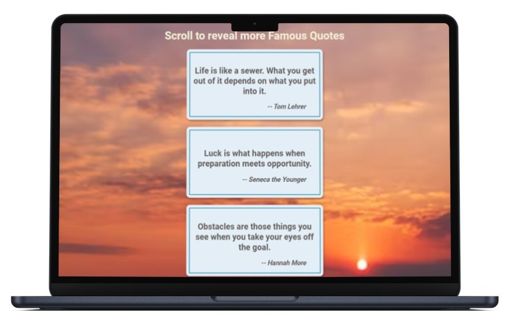

# Famous Quotes

This is a modification to the [Scroll Animation project (Day 6) in the Udemy course 50 projects in 50 Days](https://www.udemy.com/course/50-projects-50-days/?src=sac&kw=50+projects+50+days).

## Project Details

The goal of the initial project was to have boxes slide in from opposite sides of the browser when the user scrolls up or down the page. I wanted to utilize this base code and build upon it in order to present the user with a visually appealing list of famous quotes. To accomplish this, I had to:

- Implement a fetch API to pull a specific type and quantity of quotes.
- Restrict the quotes to a limited number of characters.
- Utilize the forEach() method to loop over the quotes array.
- Target the content and author of each quote.
- Update the text of each box to reflect the quote and author. 

### View My Project: [https://ll-zerr.github.io/famous-quotes/](https://ll-zerr.github.io/famous-quotes/)

## Features

- Page loads with minimal famous quotes.
- Additional quotes animate in on scroll down.
- Visible quotes animate out on scroll up.

## Technologies Used

- HTML5
- CSS3
- JavaScript
- Fetch API

## Acknowledgements

Original Project idea: Brad Traversy, Florin Pop [Udemy course 50 Projects in 50 Days](https://www.udemy.com/course/50-projects-50-days/?src=sac&kw=50+projects+50+days)

Original HTML, CSS & Javascript provided by: Brad Traversy, Florin Pop [Udemy course 50 Projects in 50 Days](https://www.udemy.com/course/50-projects-50-days/?src=sac&kw=50+projects+50+days)

Background Image: [Dave Hoefler](https://unsplash.com/it/@davehoefler) on [Unsplash](https://unsplash.com/it/foto/Ib2-XAeuUQg)